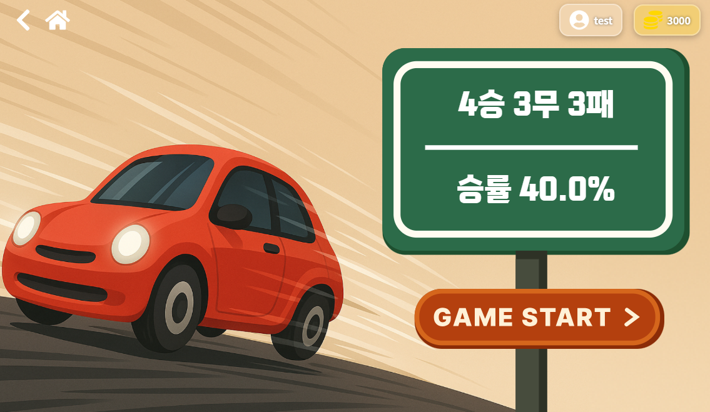
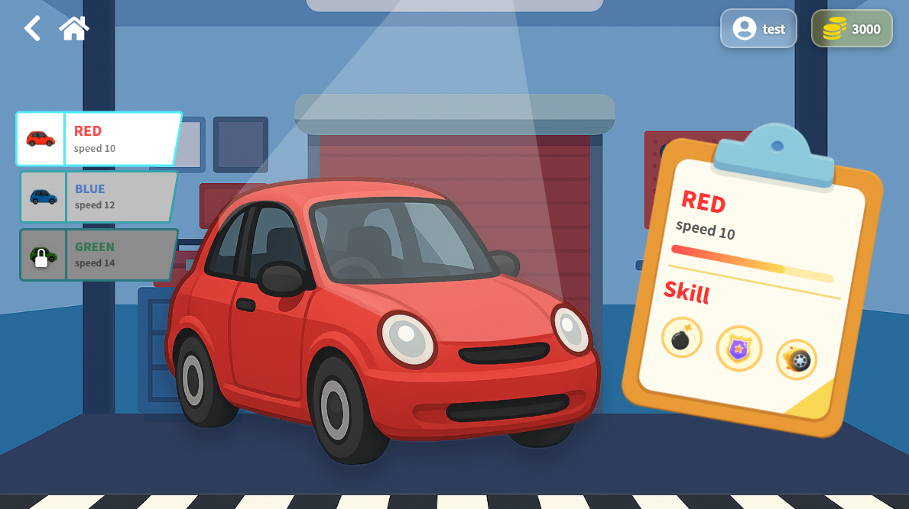
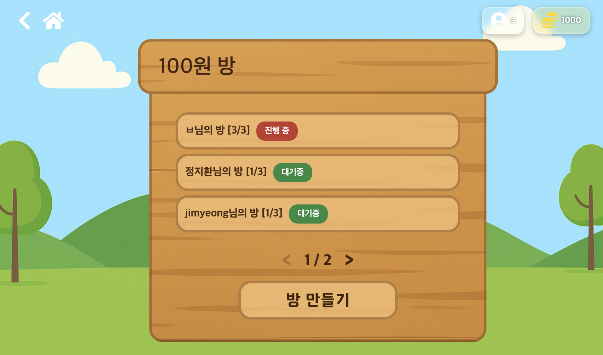
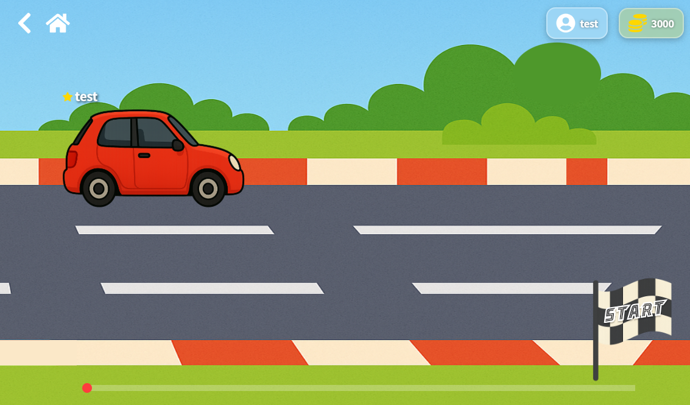
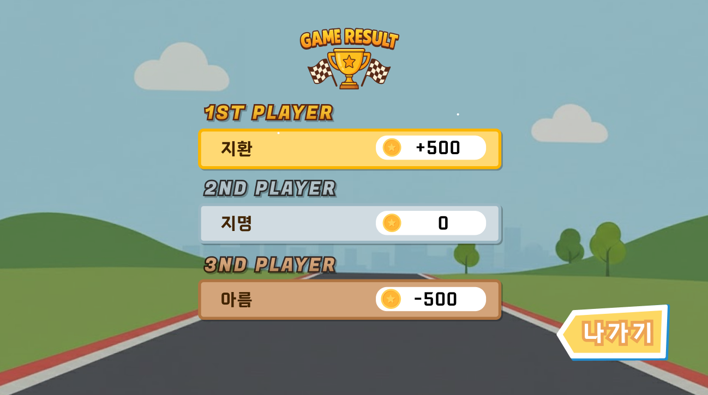

## 우레카 🚗
### 멀티플레이 자동차 레이싱 게임

우레카는 3명의 플레이어가 동시에 참여하는 멀티플레이 자동차 레이싱 게임으로,
운·전략·배팅 요소가 결합된 캐주얼 경쟁 게임입니다.

각 플레이어는 자신의 자동차로 레이스에 참여하며,
매 턴마다 적용되는 랜덤 전진 조건을 통해 예측하기 어려운 전개가 펼쳐집니다.
전진 조건을 만족하는 경우 자동차는 기존 속도보다 더욱 빠르게 치고 나가며,
조건을 만족하지 못하면 기본 속도로만 이동해, 단순한 경주를 넘어선 인터랙티브한 플레이 경험을 제공합니다.

게임은 3명의 플레이어가 모두 모였을 때만 시작되며,
모든 플레이어는 방의 가격에 맞춰 배팅 비용을 지불하고 경기에 참여합니다.
레이스가 끝나면 1등은 3명의 배팅비 중 일부를 추가로 획득하고,
3등은 배팅비를 전부 잃는 구조로, 경쟁의 긴장감과 몰입감을 높였습니다.

또한 유저는 회원가입 및 로그인 기반의 계정 시스템을 통해
본인의 자동차, 아이템, 보유 포인트 등을 지속적으로 관리하며 게임을 즐길 수 있습니다.

## 프로젝트 상세 설명
### 🔌 실시간 멀티플레이
WebSocket을 통해 구현된 게임으로 실시간으로 통신하여, 사용자가 혼자 게임을 하는 것이 아니라,
다른 실제 플레이어들과 동시에 레이스를 즐길 수 있는 환경을 제공합니다. 

방 생성 및 참여, 레이스 진행, 순위 결과 등이 모두 실시간으로 동기화되어 매 순간 변화하는 긴장감이 있는 플레이가 가능합니다.

### 🎲 랜덤 전진 조건 기반 레이싱
자동차는 매 시간마다 전진이 랜덤으로 진행되어 자동자가 이동합니다.  
자동차는 전진 조건을 만족하면 기존 속도보다 더 빠른 속도로 질주하고, 조건을 충족하지 못하면 기본 속도로만 이동하게 됩니다.

이 설계는 예측하기 어려운 전개를 만들어내어, 단순 반복 경쟁이 아닌 운이 따라오는 레이싱으로 
매 경기마다 결과가 바뀌어 사용자의 흥미를 높이도록 하였습니다.

### 💰 배팅 시스템
모든 플레이어는 레이스 시작 전 게임 참여 비용(배팅비)를 지불하고 입장합니다.
- 1등 플레이어는 전체 배팅비 중 가장 큰 보상을 가져가고, 
- 3등 플레이어는 지불한 배팅비를 전부 잃는 구조로

경쟁의 몰입감과 긴장감을 극대화합니다.

### 📊 게임 전적 및 통계 제공
유저는 자신만의 계정을 통해 게임 전적과 승률을 확인할 수 있도록 하였습니다.

### 🚗 자동차 성장 시스템
유저들은 자동차를 구매하여 업그레이드할 수 있습니다.
높은 속도를 가진 자동차는 실제 레이스 게임의 결과에도 직접적인 영향을 주어,
더 강력한 자동차를 구매하고싶도록 자극합니다. 

## 시연 이미지
### 로그인 후 게임 시작 화면

- 유저의 게임 전적과 승률 

### 마이페이지

- 유저의 현재 선택된 자동차 및 구매한 자동차 확인 가능
- 구매하지 않은 자동차 구매 가능

### 대기방

- 게임 진행 중인 방이나, 대기 중인 방을 목록으로 확인할 수 있음
- 방을 선택해 게임에 들어가거나, 방을 생성할 수 있음

### 게임 경주 화면

- 플레이어 3명이 들어오면 게임 start를 누르면 게임이 실행됨
- 속도가 계속 변경되는 것을 확인할 수 있음

### 게임 결과

- 참여한 사람들의 게임 결과를 확인할 수 있음

## 시연 영상 

## 🧑‍💻 팀원 소개
| **이름** | **구현 파트**                                                                                       | 
|:------:|:------------------------------------------------------------------------------------------------|
|  정지환   | WebSocket 기반 실시간 게임 로직 전체 구축   GameRoom/Player/Thread/RoomTier 구조 정비   STOMP memberId 기반 인증체계 확립   프론트 Race 화면 실시간 움직임 연동                                                                                 | 
|  하지명   | ERD 설계   마이페이지 조회 구현   게임 전적 및 승률 계산 구현   자동차 선택 및 구매 기능 구현   구현한 API 프론트엔드와 연동 |
|  유아름   | 전체 UI/UX 기획 및 화면 구성    인트로 영상 · 레이스 UI · 결과 화면 완성   대기방/레이스/결과 페이지 전체 흐름 구축   애니메이션, 리소스, 페이지 이동 구조 설계|

## 개발 환경

<table>
  <thead>
    <tr>
      <th>분류</th>
      <th>기술 스택</th>
    </tr>
  </thead>
  <tbody>
    <tr>
      <td>프론트엔드</td>
      <td>
        
        
        
      </td>
    </tr>
  </tbody>
</table>
<table>
  <thead>
    <tr>
      <th>분류</th>
      <th>기술 스택</th>
    </tr>
  </thead>
  <tbody>
    <tr>
      <td>백엔드</td>
      <td>
        
        
        
              
        
        
      </td>
    </tr>
  </tbody>
</table>
<table>
  <thead>
    <tr>
      <th>분류</th>
      <th>기술 스택</th>
    </tr>
  </thead>
  <tbody>
    <tr>
      <td>협업 툴</td>
      <td>
        
        
      </td>
    </tr>
  </tbody>
</table>